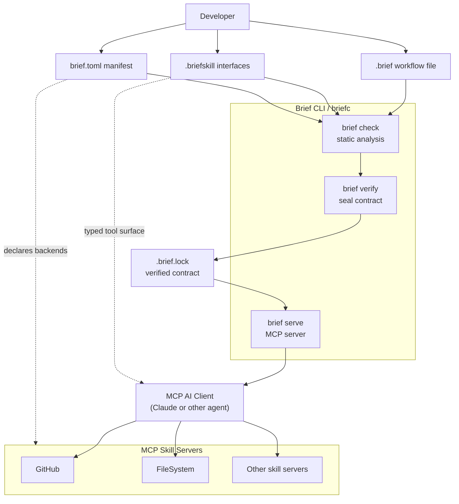
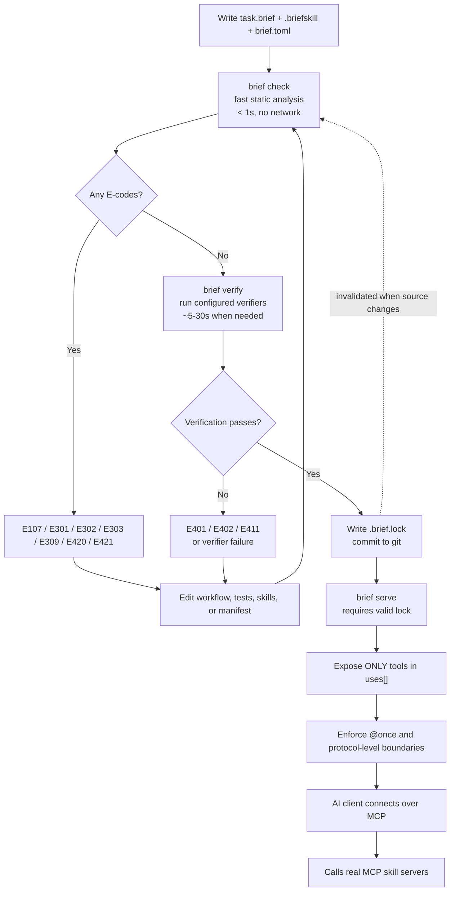
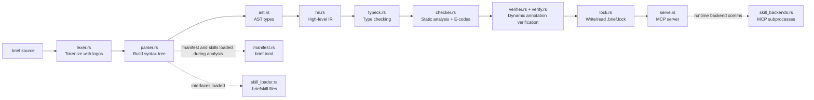
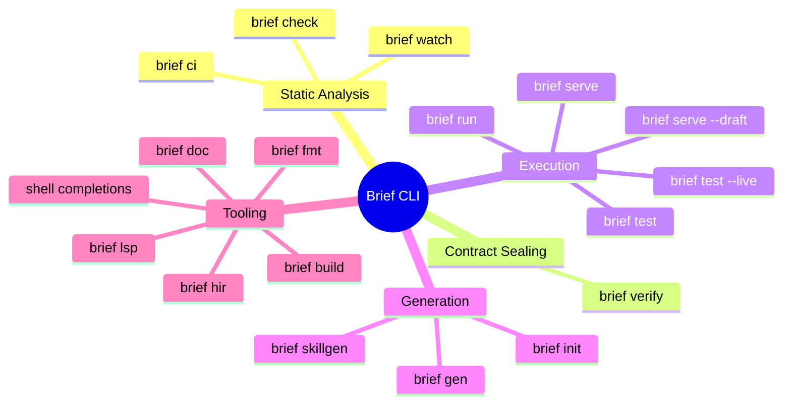
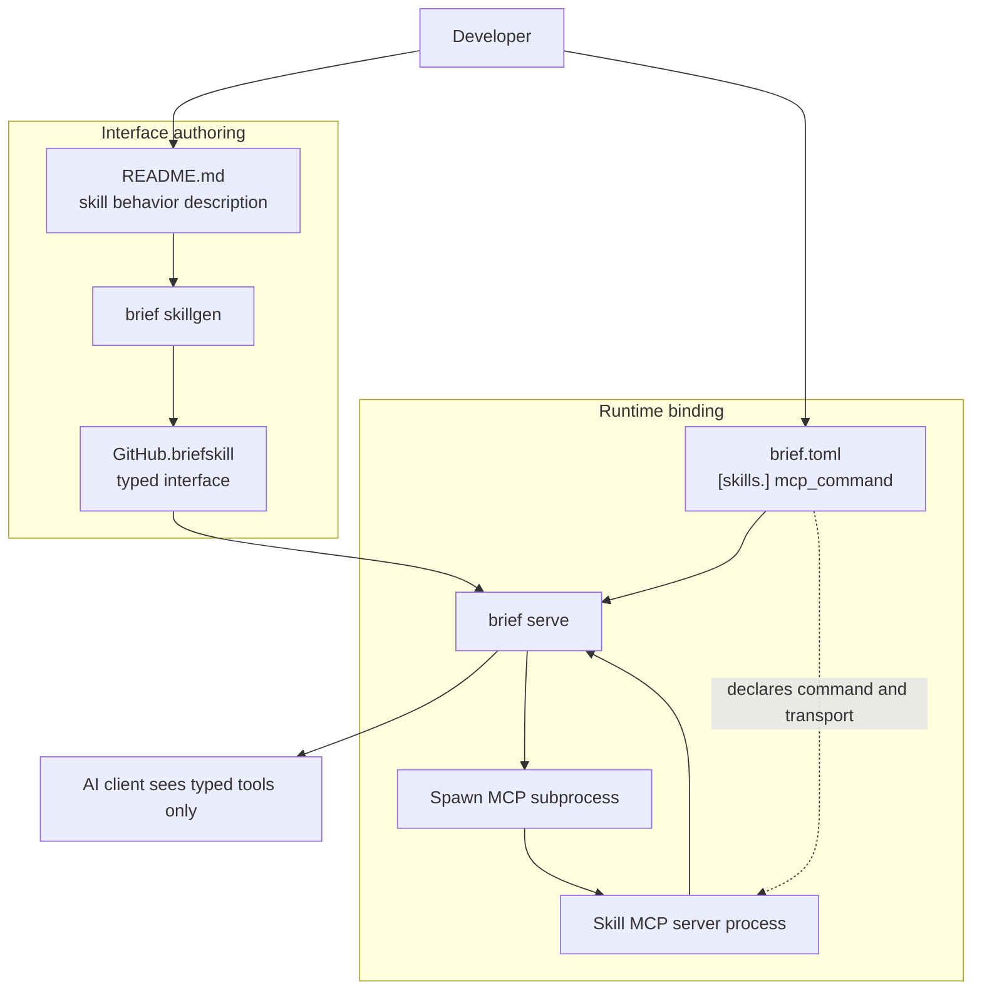
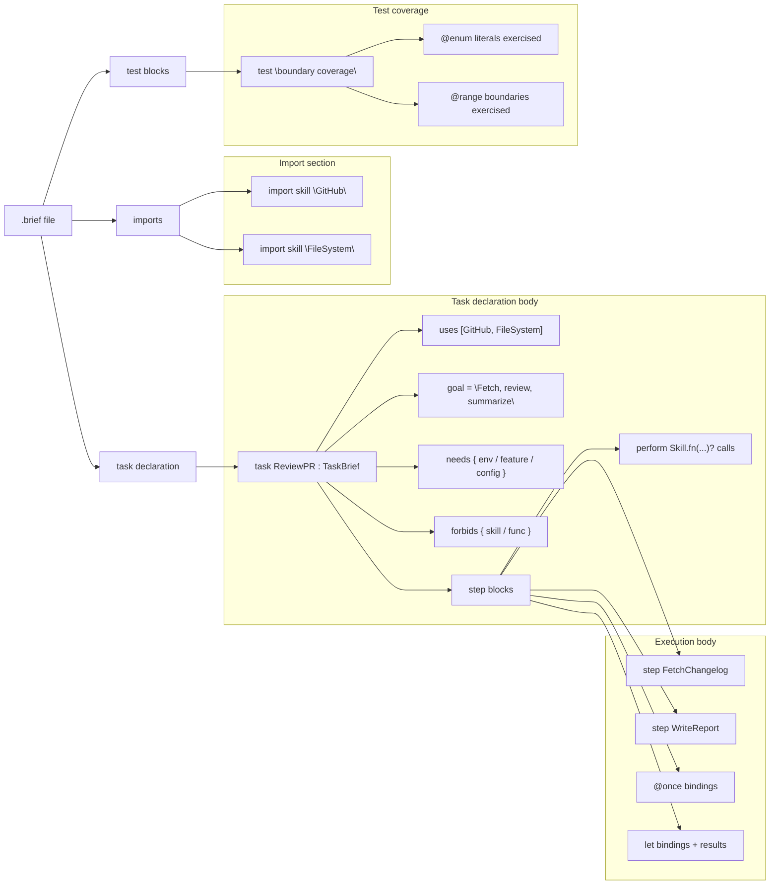
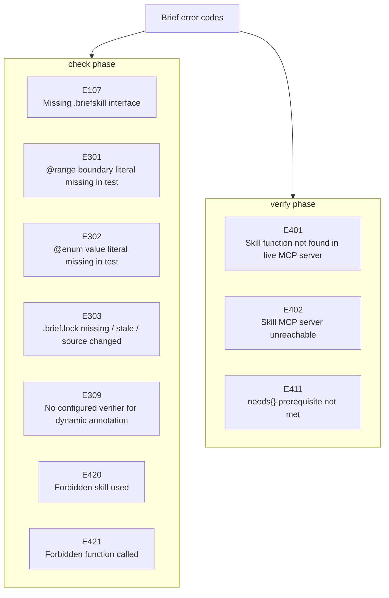
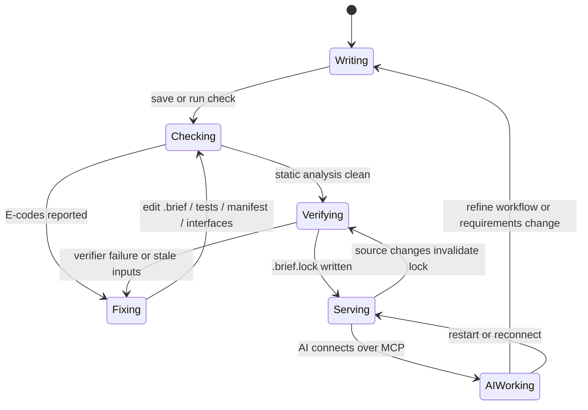
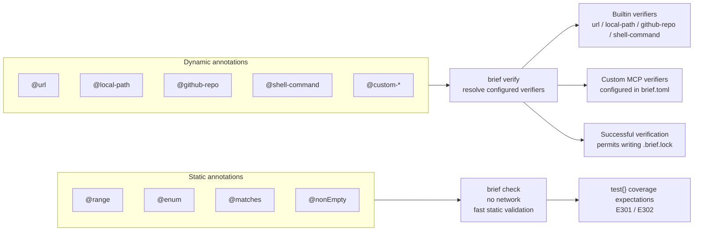

# Brief Mermaid Diagrams

## 1. System Architecture Overview



This overview shows Brief as the control plane between a developer, an AI client, and real MCP skill servers. The `.brief`, `.briefskill`, and `brief.toml` inputs are compiled and verified before `brief serve` exposes a constrained tool surface to the AI.

## 2. Enforcement Chain Flowchart



This flowchart captures Brief's no-shortcuts workflow: static checking first, then verification, then serving. It also highlights the feedback loop where E-codes force iteration until the contract is both statically clean and dynamically sealed.

## 3. Compiler Pipeline



This pipeline shows how Brief moves from raw source text to a served MCP contract. Supporting modules such as `manifest.rs`, `skill_loader.rs`, and `skill_backends.rs` feed configuration, interface loading, and runtime communication into the main compile-and-serve path.

## 4. CLI Commands Mind Map



This mind map groups Brief commands by the job they do instead of alphabetically. It makes the product shape clear: some commands analyze and seal contracts, some execute workflows, and others help generate or inspect Brief projects.

## 5. Skill Architecture



This diagram separates the human-authored interface side from the runtime implementation side. In Brief, the AI reads the `.briefskill` contract, while the actual work is executed by an MCP server process declared in `brief.toml` and spawned by `brief serve`.

## 6. .brief File Anatomy



This anatomy diagram shows the major structural parts of a `.brief` file: imports, a typed task declaration, governance blocks, executable steps, and tests. It emphasizes that a Brief file is not just imperative code; it also contains boundary rules and test coverage requirements.

## 7. Brief File to Serve Sequence Diagram

```mermaid
sequenceDiagram
    actor Developer
    participant briefc
    participant Verifier as MCP-Verifier
    participant Lock as .brief.lock
    participant AI as AI-Client
    participant Skill as Skill-MCP-Server

    Developer->>briefc: Write task.brief + interfaces + manifest
    Developer->>briefc: brief check task.brief
    briefc-->>Developer: Static diagnostics / E-codes until clean
    Developer->>briefc: brief verify task.brief
    briefc->>Verifier: Verify dynamic annotations and live skill surface
    Verifier-->>briefc: Pass or E401 / E402 / E411
    briefc->>Lock: Write verified lock file
    Developer->>briefc: brief serve task.brief
    briefc->>Lock: Validate lock freshness
    Lock-->>briefc: Contract is current
    AI->>briefc: tools/list + tool call
    briefc-->>AI: Only uses[] tools exposed; @once tracked; forbids enforced
    briefc->>Skill: Proxy allowed MCP call
    Skill-->>briefc: Tool result
    briefc-->>AI: Typed result
```

This sequence diagram follows the happy path from authoring to live AI execution. It also shows where enforcement actually happens: Brief validates the lock, limits the exposed tool list, and only then proxies permitted calls to the underlying skill MCP server.

## 8. Error Code Map



This map groups errors by the phase that emits them, which is how developers usually diagnose Brief failures. The separation makes it clear that some failures are purely local and static, while others only appear when Brief verifies against live prerequisites and skill servers.

## 9. Typical Developer Workflow



This state diagram shows the normal operating loop for a Brief project. Developers bounce between writing and fixing until static checks pass, then move into verification and serving, with any source change pushing the workflow back toward verification.

## 10. Annotation System



This diagram shows the split between annotations the compiler can prove locally and annotations that require external validation. Static annotations are handled entirely during `brief check`, while dynamic annotations are routed through configured builtin or custom verifiers during `brief verify`.
